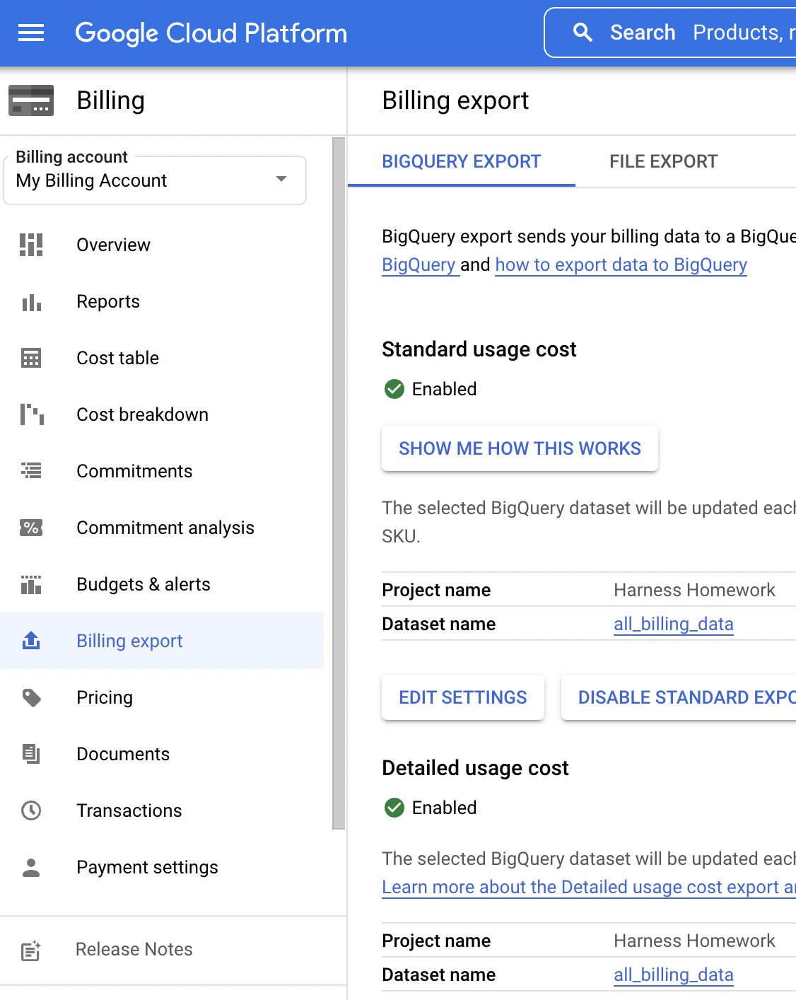

# lab-may-2022


This is an overview of some of my learnings from hands on exercises with CI/CD with the Harness platform and K8 with GKE.

## Overview
- [ ] Set up GKE.
- [ ] Install Harness delegate.
- [ ] Setup Harness CI.
- [ ] Setup Harness CD.
- [ ] Setup Harness Cloud Cost Management (in-progress).

## Set up GKE
1. Follow [GKE Quick Start](https://cloud.google.com/kubernetes-engine/docs/deploy-app-cluster#standard).
2. Reuse hello-cluster created above. 
3. Per GCP documentation on [enabling autoscaling](https://cloud.google.com/kubernetes-engine/docs/how-to/cluster-autoscaler), run these commands to enable autoscaling on the cluster created
```
gcloud container clusters update hello-cluster --enable-autoprovisioning --min-cpu 8 --min-memory 8 --max-cpu 12 --max-memory 24 --autoprovisioning-scopes=https://www.googleapis.com/auth/logging.write,https://www.googleapis.com/auth/monitoring,https://www.googleapis.com/auth/devstorage.read_only --zone us-west1-a
gcloud container node-pools update default-pool --enable-autoprovisioning --zone us-west1-a
```

## Install Harness delegate in GKE
This video does a good job walking through the delegate setup process: [Install a Kubernetes Delegate](https://ngdocs.harness.io/article/f9bd10b3nj-install-a-kubernetes-delegate#sort=relevanc)<br>
This is where I spent the most time. I initially attempted [minikube setup with Harness](https://community.harness.io/t/minikube-setup-with-harness/22) but ran into several issues that I spent too much time troubleshooting.
* The namespace ends in '-ng' so the setup guide needs updated.
* Several services failed to start on my M1 MacBook Pro. I believe the failure of the API service prevented Harness from talking to my minikube, and vice versa.
* I'm not sure if minikube isn't quite ready for Apple silicon yet (note: Virtual Box isn't supported on M1), or if I ran into proxy/firewall issues trying to talk to Harness from my corporate endpoint. I had to throw in the towel before getting to the bottom of it. 
  * That said, the troubleshooting helped me better understand minikube, kubectl, and k8 in general. 
  
## Harness CI Quick Start
* Great documentation at [CI Quick Start](https://ngdocs.harness.io/article/x0d77ktjw8-ci-pipeline-quickstart)
* As previously mentioned, I ran into some issues with the GKE hello-cluster not having autoscaling enabled and not meeting minimum compute requirements for the delegate and build farm but after searching Google's documentation, I got the issues resolved.
* I used the Hello World repo in the Harness quick start guide (https://github.com/keen-software/goHelloWorldServer)
* I created a new Docker Hub account, repo, and PAT.<br><br>
**Success!**


<br><br>
Confirming the Docker image got pushed to my Docker Hub repo.


## Harness CD Quick Start
* Followed the [Kubernetes CD Quick Start](https://ngdocs.harness.io/article/knunou9j30-kubernetes-cd-quickstart)
* Failed the first time because I reused my GitHub connector from the CI Quick Start that was configured for a different repo. I created a new connector pointing to the k8 repo and.....<br><br>
**Success!**


<br><br>
Confirming nginx was deployed to my GKE cluster. Public IP listed in GCP console.


## Setup Harness Cloud Cost Management
1. [Setup GCP Cloud Billing Export to BigQuery](https://cloud.google.com/billing/docs/how-to/export-data-bigquery-setup)<br>
2. Follow Harness documentation for [Set Up Cloud Visibility for GCP](https://docs.harness.io/article/x53e2by67m-enable-cloud-efficiency-for-google-cloud-platform-gcp)


## Notes
* It took some trial and error to get my GKE environment configured with enough resources for CI to run successfully. 
* I used the GCP console's cloud shell due to proxy issues running locally.
* I spent too much time troubleshooting minikube on my local machine.
  * GKE was a breeze! (once I got auto-scaling working)
* GCP billing export will take 24-48 hours to populate in Big Query and make its way to Harness Cloud Cost Management (waiting to validate the setup).
  
## Links
- Repository: https://github.com/parsontodd/lab-may-2022
- References:
  - [GKE Quick Start](https://cloud.google.com/kubernetes-engine/docs/deploy-app-cluster#standard)
  - [GKE Enabling Autoscaling](https://cloud.google.com/kubernetes-engine/docs/how-to/cluster-autoscaler)
  - [Harness CI Quick Start](https://ngdocs.harness.io/article/x0d77ktjw8-ci-pipeline-quickstart)
  - [Harness Kubernetes CD Quick Start](https://ngdocs.harness.io/article/knunou9j30-kubernetes-cd-quickstart)
  - [Harness Install a Kubernetes Delegate](https://ngdocs.harness.io/article/f9bd10b3nj-install-a-kubernetes-delegate#sort=relevanc)
  - [Set Up Cloud Visibility for GCP](https://docs.harness.io/article/x53e2by67m-enable-cloud-efficiency-for-google-cloud-platform-gcp)


